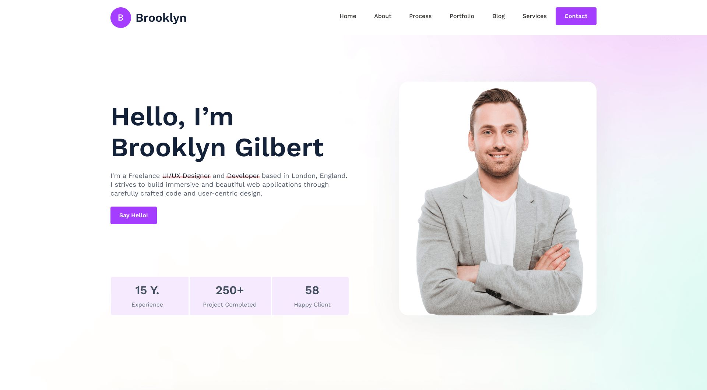

    

 <a href="https://picto-html-single-page-template.netlify.app/">
        See live
    </a>

## About Brooklyn 

<h4>Rapidly build modern websites without ever leaving your HTML.</h4>

A utility-first CSS framework packed with classes like flex, pt-4, text-center and rotate-90 that can be composed to build any design, directly in your markup.

<!-- - [Header] -->
- [Header]
- [banner]
- [about]
- [service]
- [Protfolio]
- [blog]
- [contact]
- [footer]

- Because Tailwind is so low-level, it never encourages you to design the same site twice. Even with the same color palette and sizing scale, it's easy to build the same component with a completely different look in the next project.

#To get started:

1.Clone the repository:

git clone https://github.com/emon21/pict-personal-html-project.git

cd brooklyn

2.Install the dependencies:

# Using npm
npm install

# Using Yarn
yarn

3.Start the development server:

# Using npm
npm run serve

# Using Yarn
yarn serve
Now you should be able to see the project running at localhost:5502.

4.Open public/index.html in your editor and start experimenting!

Building for production
To build an optimized version of your CSS, simply run:

# Using npm
npm run prod

# Using Yarn
yarn prod
After that's done, check out ./public/build/css/tailwind.css to see the optimized output.

